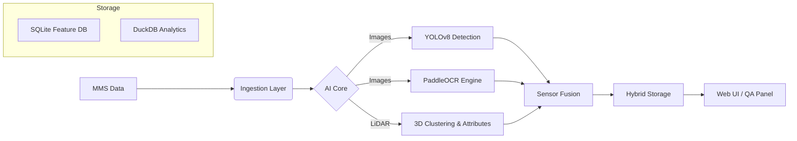

# GeoPro: AI-Powered Roadside Asset Management
### Automated Digital Twin Generation from Mobile Mapping Data (v2.2.1)

---

## 1. The Challenge
**Manual Audit is Slow & Costly**
*   **Scale:** Cities have millions of roadside assets (signs, poles, manholes).
*   **Inefficiency:** Traditional surveys involve manual driving and manual clicking.
*   **Latency:** Data is often outdated by the time it's processed.
*   **Opacity:** "Black box" AI solutions lack transparency and verifiable quality.

---

## 2. The Solution: GeoPro
**Automated Ingestion + Human Verification**
A transparent, containerized pipeline that transforms raw Mobile Mapping System (MMS) data into an actionable geospatial database.

*   **Ingest:** Raw LiDAR (.las/.laz/.ply/.pcd) + 360° Panoramic Imagery.
*   **Detect:** AI finds assets (YOLOv8 + PaddleOCR).
*   **Fuse:** 2D-to-3D and 3D-to-2D projection for precise geolocation.
*   **Analyze:** DuckDB-powered spatial analytics.
*   **Verify:** Interactive "Inspector Panel" for human QA/QC.

---

## 3. High-Level Architecture

---

## 4. Key Innovations

### 🔍 Sensor Fusion (Bi-Directional)
We don't just "guess" location from GPS.
1.  **2D -> 3D:** Project 2D detections (Signs) into 3D space to find the corresponding LiDAR cluster.
2.  **3D -> 2D:** Project 3D clusters (Poles, Trees) onto images to verify visual presence and extract crops.
3.  **Result:** Precise WGS84 coordinates + Physical Dimensions (Height, Diameter).

### 👁️ NuScenes Integration
Validated on **NuScenes v1.0-mini** (Singapore autonomous driving dataset).
*   Handled complex 6-camera + LiDAR sensor rig.
*   **Custom View Matrix:** Exact alignment between 3D world points and 2D camera pixels.

### ⚡ DuckDB Analytics
*   **In-Process OLAP:** Replaced slow iterative processing with vectorized SQL queries.
*   **Spatial Joins:** Efficiently link millions of points to road networks.
*   **Zero-Copy:** Direct access to data without serialization overhead.

---

## 5. Technology Stack

| Component | Tech Choice | Why? |
| :--- | :--- | :--- |
| **Detection** | **YOLOv8** | State-of-the-art speed/accuracy for real-time inference. |
| **OCR** | **PaddleOCR** | Superior performance on scene text (Arabic + English). |
| **Backend** | **FastAPI** | Async Python for high-throughput API. |
| **Database** | **DuckDB** | High-performance analytical queries on local files. |
| **Mapping** | **MapLibre GL JS** | Vector tile rendering for smooth, interactive maps. |
| **Deployment**| **Docker** | Fully containerized environment (Miniconda base). |

---

## 6. User Journey

1.  **Ingestion:** User drops raw `.las` files and imagery into `data/`.
2.  **Automated Processing (`geopro run`):**
    *   Point cloud downsampling & ground removal.
    *   Cluster extraction (DBSCAN).
    *   Object detection & classification.
    *   OCR text extraction (e.g., truck logos, street signs).
3.  **Quality Control (`geopro serve`):**
    *   User opens Web UI.
    *   Inspects map: Red (Unverified) -> Green (Verified).
    *   Edits attributes or OCR text if needed.
4.  **Export:** Generates GeoJSON/Shapefile for GIS integration.

---

## 7. Future Roadmap
*   **PostGIS Integration:** Scale from DuckDB to enterprise SQL for multi-user editing.
*   **Vector Tiles (MVT):** Serve millions of points efficiently over the web.
*   **Fine-Tuning:** Retrain YOLO on GCC-specific road signs.
*   **3D Mesh Generation:** Reconstruct sign surfaces for better OCR.

---

### *Ready for Deployment*
*   **Docker Hub:** `salmaniv/geopro-demo`
*   **GitHub:** `Ahmed-Ali-Salman/Geopro_Demo`
